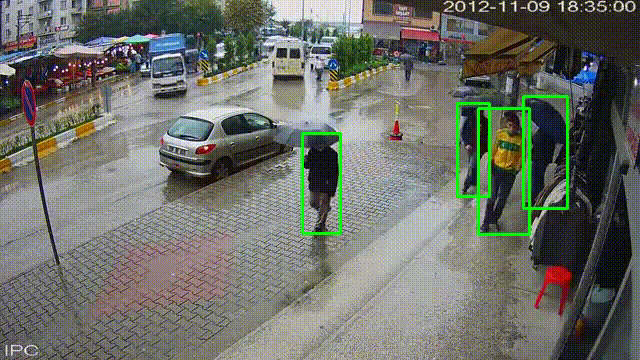

Person Tracking and Re-Identification from CCTV Footage

A computer vision pipeline for person detection, multi-object tracking, and face re-identification in CCTV footage using YOLO11, InsightFace, and FAISS.

---

Demo

The following animation demonstrates the complete processing pipeline, including person detection, tracking, face recognition, and identity assignment.

<p align="center">
  
</p>---

Live Demo

A deployed Streamlit application is available for trying the project without local installation.

Application URL

https://cryptic-eye.streamlit.app

Using the Web Application

1. Open the deployed Streamlit application.
2. Upload a CCTV video.
3. Configure the processing parameters from the sidebar.
4. Click Start Processing.
5. View the processed video with person tracking and identity annotations.
6. Assign names to newly detected Face IDs.
7. Download the generated logs, face database, and identity mappings.

«Note: The hosted application is intended for demonstration purposes. Processing speed depends on server resources and uploaded video size.»

---

Overview

This project implements a complete person tracking and face re-identification pipeline for CCTV footage. It combines object detection, multi-object tracking, face recognition, and persistent identity management to identify people across video frames and across multiple video sessions.

The system detects people using YOLO, extracts facial embeddings using InsightFace, matches identities using cosine similarity and FAISS, stores facial embeddings for future recognition, and generates appearance logs containing timestamps and durations for every detected individual.

A Streamlit web application is included to simplify video processing, identity management, and result visualization.

---

Features

- Person detection using YOLO11
- Multi-object person tracking
- Face detection and embedding extraction using InsightFace
- Persistent face database for cross-video recognition
- Fast similarity search using FAISS
- Automatic creation of new identities for unseen individuals
- Appearance logging with timestamps and durations
- Interactive Streamlit interface
- Manual assignment of names to Face IDs
- Downloadable face database, logs, and identity mappings
- Face clustering using DBSCAN for identity analysis

---

Project Structure

Person-Tracking-and-ReID-from-CCTV-footage/
│
├── ID_log/
│   ├── face_db.json
│   ├── face_names.json
│   ├── face_log.csv
│   └── face_clusters.csv
│
├── models/
│   ├── yolo11n.pt
│   ├── yolo11s.pt
│   └── yolov8n.pt
│
├── test_videos/
│   ├── output1.gif
│   └── ...
│
├── cluster.py
├── main.py
├── main_2.py
├── requirements.txt
└── README.md

---

System Pipeline

1. Detect people using YOLO11.
2. Track each detected person across frames.
3. Crop the upper-body region for face detection.
4. Extract facial embeddings using InsightFace.
5. Normalize facial embeddings.
6. Search the embedding against the persistent face database.
7. Match identities using FAISS and cosine similarity.
8. Assign a new FaceID if no match is found.
9. Store embeddings for future recognition.
10. Generate annotated output videos and appearance logs.

---

Technologies Used

Component| Library
Object Detection| YOLO11 (Ultralytics)
Multi-Object Tracking| YOLO Track
Face Recognition| InsightFace
Similarity Search| FAISS
Web Interface| Streamlit
Computer Vision| OpenCV
Numerical Computing| NumPy
Data Processing| Pandas
Deep Learning| PyTorch

---

Installation

1. Clone the Repository

git clone https://github.com/<your-username>/Person-Tracking-and-ReID-from-CCTV-footage.git

cd Person-Tracking-and-ReID-from-CCTV-footage

---

2. Create a Virtual Environment

Windows

python -m venv venv

venv\Scripts\activate

Linux / macOS

python3 -m venv venv

source venv/bin/activate

---

3. Install Dependencies

pip install -r requirements.txt

---

Requirements

streamlit==1.36.0
ultralytics==8.2.90
insightface==0.7.3
faiss-cpu==1.7.4
numpy==1.26.4
pandas==2.2.2
opencv-python-headless==4.10.0.84
torch==2.2.2
torchvision==0.17.2
onnx==1.16.2
onnxruntime==1.18.0
protobuf==4.25.3
tqdm==4.66.4

Note

- "faiss-cpu" is used by default.
- "faiss-gpu" can be installed if CUDA is available for faster similarity search.

---

Model Files

Place the pretrained YOLO weight files inside the "models/" directory.

models/
├── yolo11n.pt
├── yolo11s.pt
└── yolov8n.pt

The current implementation uses:

models/yolo11s.pt

---

Running the Project

Option 1 — Streamlit Application (Recommended)

Run Locally

Launch the web application:

streamlit run main_2.py

Then:

1. Open the local URL displayed in the terminal.
2. Upload a CCTV video.
3. Configure the processing parameters from the sidebar.
4. Click Start Processing.
5. View the processed video.
6. Assign names to newly detected Face IDs.
7. Download the generated logs and databases if required.

Use the Hosted Application

Instead of running the project locally, you can use the deployed application:

https://cryptic-eye.streamlit.app

---

Option 2 — Standalone Python Script

Modify the input and output paths in "main.py" if necessary.

INPUT_PATH = "test.mp4"
OUTPUT_PATH = "output.mp4"

Run:

python main.py

Outputs:

- Annotated video
- "face_db.json"
- "face_log.csv"

---

Option 3 — Face Clustering

Once the face database and logs have been generated:

python cluster.py

This produces:

ID_log/
└── face_clusters.csv

The clustering groups visually similar identities using DBSCAN and cosine similarity.

---

Output Files

face_db.json

Stores normalized facial embeddings for every detected identity.

face_names.json

Stores the mapping between Face IDs and assigned names.

face_log.csv

Contains appearance information for every detected individual.

FaceID| Name| StartTime| EndTime| DurationSeconds| RunTimestamp

face_clusters.csv

Contains grouped identities after DBSCAN clustering.

ClusterID| FaceIDs| StartFrames| EndFrames| Durations

---

Configurable Parameters

The Streamlit interface exposes several adjustable parameters.

Parameter| Description
Similarity Threshold| Minimum cosine similarity required for identity matching
Embedding Buffer Size| Number of embeddings retained per identity
Face Detection Interval| Frames skipped between face detections
Processing FPS| Frame rate used during inference
Minimum Track Duration| Minimum tracking duration before assigning an identity

---

Identity Assignment

The application supports persistent identity naming.

Workflow:

1. Detect a new face.
2. Assign a new FaceID.
3. Enter the person's name after processing.
4. Save the mapping.
5. Future detections automatically display the assigned name.

---

Face Matching Strategy

The recognition pipeline performs:

- Face embedding extraction
- Embedding normalization
- FAISS nearest-neighbor search
- Cosine similarity verification
- Brute-force fallback when FAISS is unavailable
- Persistent embedding updates for improved future recognition

---

Future Improvements

Potential extensions include:

- Multi-camera person re-identification
- GPU-accelerated FAISS support
- ByteTrack or DeepSORT integration
- Face quality assessment
- Live RTSP/IP camera support
- Automatic face gallery management
- Identity analytics dashboard
- REST API deployment
- Docker containerization
- PostgreSQL or SQLite database integration

---

License

This project is intended for academic and research purposes. Users are responsible for ensuring compliance with local privacy regulations and organizational policies when processing CCTV footage containing identifiable individuals.
The system detects people using YOLO, extracts facial embeddings using InsightFace, matches identities using cosine similarity and FAISS, stores facial embeddings for future recognition, and generates appearance logs containing timestamps and durations for every detected individual.

A Streamlit web application is included to simplify video processing, identity management, and result visualization.

---

## Features

- Person detection using YOLO11
- Multi-object person tracking
- Face detection and embedding extraction using InsightFace
- Persistent face database for cross-video recognition
- Fast similarity search using FAISS
- Automatic creation of new identities for unseen individuals
- Appearance logging with timestamps and durations
- Interactive Streamlit interface
- Manual assignment of names to Face IDs
- Downloadable face database, logs, and identity mappings
- Face clustering using DBSCAN for identity analysis

---

## Project Structure

```text
Person-Tracking-and-ReID-from-CCTV-footage/
│
├── ID_log/
│   ├── face_db.json
│   ├── face_names.json
│   ├── face_log.csv
│   └── face_clusters.csv
│
├── models/
│   ├── yolo11n.pt
│   ├── yolo11s.pt
│   └── yolov8n.pt
│
├── test_videos/
│   ├── output1.gif
│   └── ...
│
├── cluster.py
├── main.py
├── main_2.py
├── requirements.txt
└── README.md
```

---

## System Pipeline

1. Detect people using YOLO11.
2. Track each detected person across frames.
3. Crop the upper-body region for face detection.
4. Extract facial embeddings using InsightFace.
5. Normalize facial embeddings.
6. Search the embedding against the persistent face database.
7. Match identities using FAISS and cosine similarity.
8. Assign a new FaceID if no match is found.
9. Store embeddings for future recognition.
10. Generate annotated output videos and appearance logs.

---

## Technologies Used

| Component | Library |
|----------|----------|
| Object Detection | YOLO11 (Ultralytics) |
| Multi-Object Tracking | YOLO Track |
| Face Recognition | InsightFace |
| Similarity Search | FAISS |
| Web Interface | Streamlit |
| Computer Vision | OpenCV |
| Numerical Computing | NumPy |
| Data Processing | Pandas |
| Deep Learning | PyTorch |

---

# Installation

## 1. Clone the Repository

```bash
git clone https://github.com/<your-username>/Person-Tracking-and-ReID-from-CCTV-footage.git

cd Person-Tracking-and-ReID-from-CCTV-footage
```

---

## 2. Create a Virtual Environment

### Windows

```bash
python -m venv venv

venv\Scripts\activate
```

### Linux / macOS

```bash
python3 -m venv venv

source venv/bin/activate
```

---

## 3. Install Dependencies

```bash
pip install -r requirements.txt
```

---

## Requirements

```text
streamlit==1.36.0
ultralytics==8.2.90
insightface==0.7.3
faiss-cpu==1.7.4
numpy==1.26.4
pandas==2.2.2
opencv-python-headless==4.10.0.84
torch==2.2.2
torchvision==0.17.2
onnx==1.16.2
onnxruntime==1.18.0
protobuf==4.25.3
tqdm==4.66.4
```

**Note**

- `faiss-cpu` is used by default.
- `faiss-gpu` can be installed if CUDA is available for faster similarity search.

---

## Model Files

Place the pretrained YOLO weight files inside the `models/` directory.

```text
models/
├── yolo11n.pt
├── yolo11s.pt
└── yolov8n.pt
```

The current implementation uses:

```text
models/yolo11s.pt
```

---

# Running the Project

## Option 1 — Streamlit Application (Recommended)

Launch the web application:

```bash
streamlit run main_2.py
```

Then:

1. Open the local URL displayed in the terminal.
2. Upload a CCTV video.
3. Configure the processing parameters from the sidebar.
4. Click **Start Processing**.
5. View the processed video.
6. Assign names to newly detected Face IDs.
7. Download the generated logs and databases if required.

---

## Option 2 — Standalone Python Script

Modify the input and output paths in `main.py` if necessary.

```python
INPUT_PATH = "test.mp4"
OUTPUT_PATH = "output.mp4"
```

Run:

```bash
python main.py
```

Outputs:

- Annotated video
- `face_db.json`
- `face_log.csv`

---

## Option 3 — Face Clustering

Once the face database and logs have been generated:

```bash
python cluster.py
```

This produces:

```text
ID_log/
└── face_clusters.csv
```

The clustering groups visually similar identities using DBSCAN and cosine similarity.

---

## Output Files

### face_db.json

Stores normalized facial embeddings for every detected identity.

### face_names.json

Stores the mapping between Face IDs and assigned names.

### face_log.csv

Contains appearance information for every detected individual.

| FaceID | Name | StartTime | EndTime | DurationSeconds | RunTimestamp |
|--------|------|-----------|---------|-----------------|--------------|

### face_clusters.csv

Contains grouped identities after DBSCAN clustering.

| ClusterID | FaceIDs | StartFrames | EndFrames | Durations |
|-----------|----------|-------------|-----------|-----------|

---

## Configurable Parameters

The Streamlit interface exposes several adjustable parameters.

| Parameter | Description |
|-----------|-------------|
| Similarity Threshold | Minimum cosine similarity required for identity matching |
| Embedding Buffer Size | Number of embeddings retained per identity |
| Face Detection Interval | Frames skipped between face detections |
| Processing FPS | Frame rate used during inference |
| Minimum Track Duration | Minimum tracking duration before assigning an identity |

---

## Identity Assignment

The application supports persistent identity naming.

Workflow:

1. Detect a new face.
2. Assign a new FaceID.
3. Enter the person's name after processing.
4. Save the mapping.
5. Future detections automatically display the assigned name.

---

## Face Matching Strategy

The recognition pipeline performs:

- Face embedding extraction
- Embedding normalization
- FAISS nearest-neighbor search
- Cosine similarity verification
- Brute-force fallback when FAISS is unavailable
- Persistent embedding updates for improved future recognition

---

## Future Improvements

Potential extensions include:

- Multi-camera person re-identification
- GPU-accelerated FAISS support
- ByteTrack or DeepSORT integration
- Face quality assessment
- Live RTSP/IP camera support
- Automatic face gallery management
- Identity analytics dashboard
- REST API deployment
- Docker containerization
- PostgreSQL or SQLite database integration

---

## License

This project is intended for academic and research purposes. Users are responsible for ensuring compliance with local privacy regulations and organizational policies when processing CCTV footage containing identifiable individuals.
